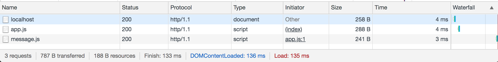
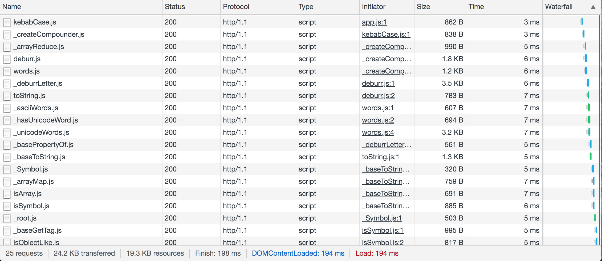
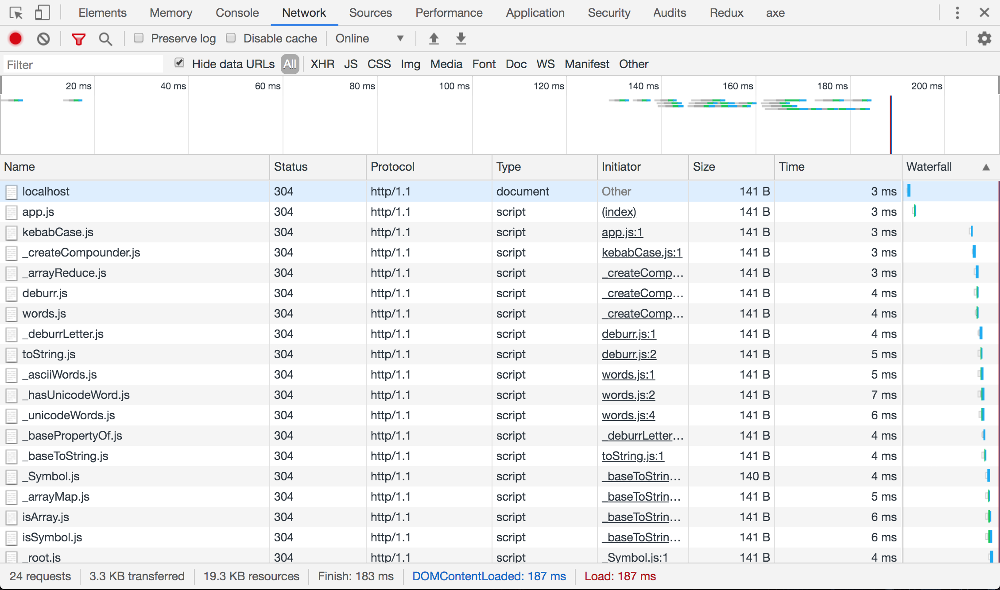

# Developing without a build
In the early days of web development all we needed was a simple file editor and a web server. The development experience was really simple, and easy for a newcomer to understand and get started. Web development has changed a lot since then, the complexity of the tools we use for development has grown just as much as the complexity of the things that we're building on the web.

These tools can be really complex, projects can set up systems which transform different syntaxes and dialects into bundles we can run in the browser. Source maps need to be configured carefully between the different tools, so that we can still recognize and debug our code in the browser.

Imagine a new person coming into web development, even experienced developers, they first need to learn about a lot of different tools before they can get to actual development. Their IDE and linter don't understand the syntax of this framework that was recommended to them by a friend. Installing a few extra plugins solved that. After that they ran into some more errors... Turns out they wanted to keep it simple and not use typescript, but they didn't configure the babel plugins for decorators correctly in the right order so the project didn't compile. Oops!

It sounds exaggerated, but these things are really happening to people. I feel that's really a shame. One of the key selling points of the web is that's an easy and open format. It should also be easy to just get started right away without a lot of ceremony.

I'm not criticizing any of the tools, they have a role and a purpose. And for a long time it was the only real way to build complex applications on the web, as the web standards and browser implementations were just not there to support modern web development. They really helped push web development forward.

However nowadays I think build tools and bundlers should be primarily for production optimization, for development I think we can go back to basics. Browser support for es module features has improved a lot in recent years.

In this article we will explore different ways of loading modules in the browser, and offer practical advice on how to handle different scenarios. We will start by looking at javascript modules, and later look at html, css and json as well.

## Loading modules in the browser
This is not exact step by step tutorial, but you can follow along with any of the examples by using any simple web server. For example `http-server` from npm. Run it with `-c-1` to disable time based caching.

```bash
npm i -D http-server
npx http-server -o -c-1
```

### Loading modules
Modules are loaded in the browser using regular script tags with a `type="module"` attribute. We can just write our module code directly inline:
```html
<!DOCTYPE html>
<html>
<head></head>

<body>
  <script type="module">
    console.log('hello world!');
  </script>
</body>

</html>
```

From here we can use static imports to load other modules:
```html
<script type="module">
  import './app.js';

  console.log('hello world!');
</script>
```

Note that we need to use an explicit file extension, as the browser doesn't know which file to request otherwise.

The same thing works if we use the `src` attribute:

```html
<script type="module" src="./app.js"></script>
```

### Loading dependencies
We don't write our code in just one file. After importing the initial module, we can import other modules. For example let's create two new files:

`src/app.js`:
```javascript
import { message } from './message.js';

console.log(`The message is: ${message}`);
```

`src/message.js`:
```js
export const message = 'hello world';
```

Place both files in a `src` directory and import `app.js` from your index.html:

```html
<!DOCTYPE html>
<html>
<head></head>

<body>
  <script type="module" src="./src/app.js"></script>
</body>

</html>
```

If you run this and check the network panel, you will see both modules being loaded. Because imports are resolved relatively, `app.js` can refer to `message.js` using a relative path:



This seems trivial, but it is extremely useful and something we did not have before with classic scripts. We no longer need to coordinate dependencies somewhere central or maintain a base url. Modules can declare their own dependencies, and we can import any module without knowing what their dependencies are. The browser takes care of requesting the correct files.

### Dynamic imports
When building any serious web application we are usually going to need to do some form of lazy loading for best performance. With the browser's module system we can do this using dynamic imports. Static imports like we saw before always need to exist on the top level.

For example we cannot write:
```javascript
if (someCondition) {
  import './bar.js';
}
```

This is what dynamic imports are for. Dynamic imports can import a module at any time. It returns a promise that resolves with the imported module.

For example let's update the `app.js` example we created above:
```javascript
window.addEventListener('click', async () => {
  const module = await import('./message.js');

  console.log(`The message is: ${module.message}`);
});
```

Now we are not importing the message module right away, but delaying it until the user has clicked anywhere on the page. We can await the promise returned from the import and interact with the modules. Any exported members are avaible on the module object.

### Lazy evaluation
This is where developing without a bundler has a significant benefit. If you bundle your application before serving it to the browser, the bundler needs to evaluate all your dynamic imports to do code splitting and output separate chunks. For large applications with a lot of dynamic imports this can add significant overhead as the entire application is built and bundled before you can see anything anything.

When serving unbundled modules the entire process is lazy, the browser only does the necessary work for loading the requested modules.

Dynamic imports are supported by the latest versions of Chrome, Safari and Firefox. It's not supported in the current version of Edge, but will be supported by the new Chromium based Edge.

[Read more about dynamic imports at MDN](https://developer.mozilla.org/en-US/docs/Web/JavaScript/Reference/Statements/import#Dynamic_Import)

### Non-relative requests
Not all browser APIs resolve requests relative to the module's location. For example when using fetch or when rendering images on the page.

To handle these cases we can use `import.meta.url` to get information about the current module's location.

`import.meta` is a special object which contains metadata about the currently executing module. `url` is the first property that's exposed here, and works a lot like `__dirname` in node js.

`import.meta.url` points to the url the module was imported with:
```js
console.log(import.meta.url); // logs http://localhost:8080/path/to/my/file.js
```

We can use the `URL` API for easy URL building. For example to request a json file:
```javascript
const lang = 'en-US';

// becomes http://localhost:8080/path/to/my/translations/en-US.json
const translationsPath = new URL(`./translations/${lang}.json`, import.meta.url);

const response = await fetch(translationsPath);
```

[Read more about import.meta at MDN](https://developer.mozilla.org/en-US/docs/Web/JavaScript/Reference/Statements/import.meta)

### Loading other packages
When building an application you will quickly run into having to include other packages from npm. This works just fine in the browser, for example let's install and use lodash:

```bash
npm i --save lodash-es
```

```javascript
import kebabCase from '../node_modules/lodash-es/kebabCase.js';

console.log('lodash: ', _);
```

Lodash is a very modular library, the `kebabCase` function depends on a lot of other modules. These dependencies are taken care of automatically, the browser resolves and imports them for you:



Writing explicit paths to your node modules folder is a bit unusual. While it works just fine, most people are used to writing what's called a bare import specifier:
```javascript
import { kebabCase } from 'lodash-es';
import kebabCase from 'lodash-es/kebabCase.js';
```

This doesn't work in the browser out of the box, as it doesn't know what file to request when it sees this path. Luckily there is a [new browser API called import maps](https://github.com/WICG/import-maps) which lets you instruct the browser how to resolve these imports:
```html
<script type="importmap">
  {
    "imports": {
      "lodash-es": "./node_modules/lodash-es/lodash.js",
      "lodash-es/": "./node_modules/lodash-es/"
    }
  }
</script>
```

It's currently [implemented in chrome behind a flag](https://developers.google.com/web/updates/2019/03/kv-storage#import_maps), and it's easy to shim on other browsers [with es-module-shims](https://www.npmjs.com/package/es-module-shims). Until we get broad browser support, that can be an interesting option during development.

If you don't want to go quite as cutting edge but still want to use the bare imports a great option is to use a web server which rewrites the bare imports on the fly into explicit paths before serving them to the browser. There are some quite servers available that do this. Of course I recommend [es-dev-server](https://www.npmjs.com/package/es-dev-server) since I wrote it myself :)

### Caching
Because we aren't bundling all of our code into just a few files, we don't have to set up any elaborate caching strategies. Your web server can use the file system's last modified timestamp to return a 304 if the file hasn't changed.

You can test this in your browser by turning off `Disable cache` and refreshing:



## Non-js modules
So far we've only looked into javascript modules, and the story is looking pretty complete. It looks like we've got the tools needed to build different kinds of applications. But on the web we're not just writing javascript, we need to deal with other langauges as well.

The good news is that there are proposals for html, css and json modules and all major browser vendors seem to be supportive of them:
- [json modules](https://github.com/whatwg/html/issues/4315)
- [html modules](https://github.com/w3c/webcomponents/issues/645)
- [css modules](https://github.com/w3c/webcomponents/issues/759)

The bad news is that they're not available just yet, and it will be a while for all browsers to support them. We have to look for some solutions in the meantime.

### JSON
In Node JS it's possible to import json files from javascript. These becomes available as javascript object. In web projects this is used frequently as well. There are many build tool plugins to make this possible.

Until browsers support json modules, we can either just use a javascript module or use fetch to retreive the json files. See the `import.meta.url` section of an example of using fetch.

### HTML
Over time web frameworks have solved html templating in different ways, for example by placing HTML inside javascript strings. Lately JSX has become a popular format for embedding HTML inside javascript, but it is not going to run natively in the browser without some kind of transformation.

With es2015/es6 we can use tagged template string literals to embed html inside js, and use it for doing efficient DOM updates. This runs natively in the browser and still offers a great developer experience. There are some really good production ready and feature complete libraries that can be used for this:

- [htm, JSX using template literals. Works with libraries that use JSX, such as react](https://www.npmjs.com/package/htm)
- [lit-html, a html templating library](https://www.npmjs.com/package/lit-html)
- [lit-element, integrates lit-html with web components](https://www.npmjs.com/package/lit-element)
- [haunted, a functional web components library with react-like hooks](https://www.npmjs.com/package/haunted)
- [hybrids, another functional web component library](https://www.npmjs.com/package/hybrids)
- [hyperHTML, a html templating library](https://www.npmjs.com/package/hyperhtml)
(TODO: more libraries?)

For syntax highlighting you might need to configure your IDE or install a plugin.

### CSS
For HTML and JSON there are sufficient alternatives. Unfortunately with CSS it is more complicated. By itself CSS is not modular as it affects the entire page. A common complaint that this is what makes CSS so difficult to scale.

There a lot of different ways to write css, it's beyond the scope of this article to look into all of them. When working without a build, regular stylesheets will just work fine of course.

If you are using some kind of CSS preprocessor you can run it before running your web server and just load the CSS output. Many CSS in JS solutions should also work if the library publishes an es module format.

#### Shadow dom
For truly modular CSS I recommend looking into [Shadow dom](https://developer.mozilla.org/en-US/docs/Web/Web_Components/Using_shadow_DOM), it fixes many of the scoping and encapsulation problems of CSS. Unfortunately, it's not yet a complete story. There are still missing features that are being worked out in the standard so it may not yet be the right solution in all scenarios. (TODO: Link to article?)

Good to mention here is [the lit-element library](https://www.npmjs.com/package/lit-element), which offers a great developer experience when authoring modular CSS without a build step. `lit-element` does most of the heavy lifting for you. You author css using tagged template literals, which are just syntax sugar for creating a [Constructable Stylesheet](https://developers.google.com/web/updates/2019/02/constructable-stylesheets). This way you can write and share CSS between your components. This will integrate well with css modules when they are shipped.

### Library support
Luckily the amount of libraries shipping as es module format is growing steadily. But there are still popular libraries which only as ship UMD or common js. These don't work without some kind of code transformation. The best thing we can do it open issues on these projects to give them an indication how many people are interested in supporting the native module syntax.

I think this is a problem that will disappear relatively quickly, especially after Node JS implements es modules as well. Many projects already use es modules as their authoring format, and I don't think anyone likes having to ship multiple module formats.

## Building
The goal of this article was to explore workflows where we don't need to do any building for development, and I think we've proven it's really possible. However it's important to reitarate that I don't think that build tools are evil, or that I want to pretend that noone will need to use any building at all during development.

Instead I think the starting point should be reverted. Instead of trying to make our production build work during development, we should be writing standard code that runs in the browser as is and perform light transformation on that code where necessary.

## es-dev-server
You can do almost everything described in this article with any regular http server. That being said, there are still web server features which can really help the development experience. For example smart caching, SPA routing, resolving node modules, reloading the browser on file changes and making your code compatible for running on older browsers.

For this reason I created [es-dev-server](https://www.npmjs.com/package/es-dev-server). (TODO: Link to article)

## Getting started
To get started with developing without any build tools, you can use the `open-wc` project scaffolding to set up the basics:
```bash
npm init @open-wc
```

It sets up the project with a `lit-element`, a web component library. But you can swap this for any library of your choosing, the setup is not specific to web components.
