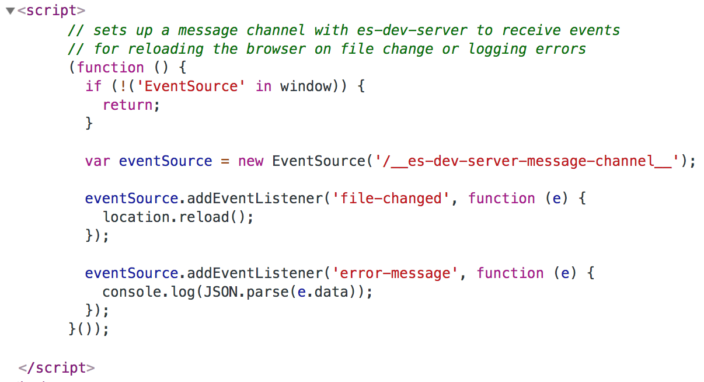
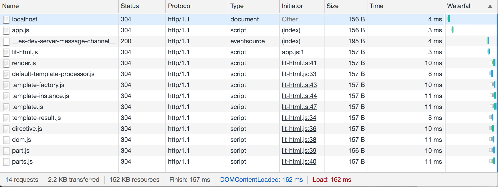
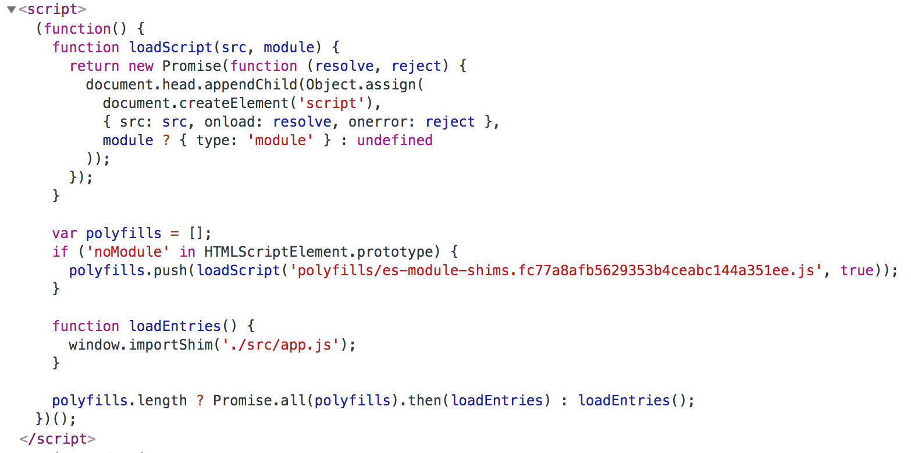

# Developing Without a Build: es-dev-server
This article is part of a series on developing without a build:
- Introduction
- es-dev-server (this article)
- Testing (coming soon!)

In the introduction, we looked into different workflows and browser APIs. In this article, we will look into how we can set up `es-dev-server`, and how it helps with development without a build.

## es-dev-server

[es-dev-server](https://www.npmjs.com/package/es-dev-server) is a composable web server that focuses on developer productivity when developing with a build step. Through options, you can opt into features such as caching, reloading on file changes, SPA routing, resolving bare module imports and compatibility modes to support older browsers.

## Setup
To start let's create an empty npm project and install `es-dev-server`:

```bash
npm init
cd <your-project-name>
npm i -D es-dev-server
```

Create an `index.html` in the root of your project:
```html
<!DOCTYPE html>
<html>
<head></head>

<body>
  <div id="app"></div>
  <script type="module" src="./src/app.js"></script>
</body>

</html>
```

Create a `src/app.js` file:
```javascript
console.log('hello world');
```

We can now view our application with `es-dev-server`:
```bash
npx es-dev-server --open
```

## Bare imports
One of the first things you will run into when developing without any build tools is how to deal with bare module imports like this:

```javascript
import foo from 'foo';
```

Out of the box, the browser will throw an error, as it doesn't know how to handle these kinds of imports. In our previous article (TODO: Link) we explored how to use these imports by using import maps, an upcoming browser API.

Until import maps are properly supported in browsers, we can use the `--node-resolve` flag of the dev server. This will rewrite imports in your modules using NodeJS module resolution before they are served to the browser.

To see how this works let's add `lit-html`, a HTML templating library, to our project:

```bash
npm i -D lit-html
```

Change `src/app.js` to import it:
```javascript
import { render, html } from 'lit-html';

const template = html`<p>Hello world!</p>`;
render(template, document.getElementById('app'));
```

Now let's restart our server, adding the node resolve flag:
```bash
npx es-dev-server --node-resolve --open
```

If you inspect the network tab, you will see the modules are served correctly as expected.

## Watch mode
A great productivity boost is reloading the browser on file changes. Restart the server with the `watch` flag:

```bash
npx es-dev-server --watch --node-resolve --open
```

Now change anything inside one of the served files, for the rendered html in `app.js`. You will see the browser reload automatically.

Reloads are done using the `EventSource` API, which is not supported on Edge and IE11. The dev server injects a small script, which connects to a message channel endpoint:



## Caching
`es-dev-server` uses the file system's last modified timestamp to return a 304 if the file hasn't changed. This significantly speeds up reloads. You can test this in your browser by turning off `Disable cache` and refreshing:



## Folder structure
Not every project has a single `index.html` in the root of their project. `es-dev-server` works just like a regular web server, so you could serve files from any folder.

For example, let's create a new folder called `demo`, and move our `index.html` inside it.

We will need to adjust the script src path to reflect this change:
```html
<script type="module" src="../src/app.js"></script>
```

And we need to tell the server to open inside the demo folder:

```bash
npx es-dev-server --node-resolve --open /demo/
```

### Changing the root dir
We might be tempted to change the root directory of the web server in order to get rid of the `/demo/` part in the URL:

```bash
npx es-dev-server --root-dir /demo/ --open
```

However, this won't work because the web server can only serve files that are within its root directory. By default, this is the current working directory. In our case, the web server needs to be able to serve the contents of the `src` folder, as well as the `node_modules` folder.

This is a common problem when working in a monorepo when you want to serve files from a package subdirectory. Many of the modules you need to serve are in the root of the project, so you need to move the root directory up two levels:

```bash
npx es-dev-server --root-dir ../../ --open packages/my-package/index.html
```

## SPA Routing
If you are building a Single Page Application you are likely doing some form of front-end routing. In order to enable deeplinking or refreshing, the web server should return your `index.html` on deeper paths. This is sometimes called history API fallback.

Setting up a router is beyond the scope of this article, but the option is easy to enable using the `--app-index` flag:

```bash
npx es-dev-server --node-resolve --app-index index.html --open
```

When using the `--app-index` flag, the server will automatically open the server on your app's index if you don't pass an explicit path to `--open`.

## Compatibility with older browsers
Although we can use the latest versions of the major browsers for development, we still need to support older browsers in production. We also might be using some modern browsers features not yet supported in the latest version of all the browsers.

It would be a shame if we have to run a production build every time we want to run our app on one of these browsers. `es-dev-server` supports multiple compatibility modes that help with this.

When compatibility mode is enabled, the server handles the necessary polyfills and code transformations for older browsers. This takes us into build tooling territory a little bit, so we're no longer purely "developing without build tools". I think that's fine, as we're using it specifically for browser compatibility. You have to opt-in to this behavior explicitly.

Let's see how it works in action. Add a dynamic import to `app.js` to lazy load a module when a button is clicked:

```js
import { html, render } from 'lit-html';

async function lazyLoad() {
  await import('lit-html/directives/until.js');
}

const template = html`
  <button @click=${lazyLoad}>Click me!</button>
`;
render(template, document.getElementById('app'));
```

This is a silly example, as the dynamic import does not really do anything functional. If we run this as-is on Chrome, Safari, and Firefox this works just fine. However, Edge does not yet support dynamic imports so this code would not run there.

We can turn on the lightest compatibility mode, `esm` to handle this case:
```bash
npx es-dev-server --node-resolve --compatibility esm --open
```

With `esm` enabled, `es-dev-server` injects [es-module-shims](https://www.npmjs.com/package/es-module-shims) and adds a loader script to your index. You don't need to change any of your code for this. You can view the injected script in the index file:



There is some extra boilerplate, as the other compatibility modes might add more polyfills. The polyfills are hashed so that they can be cached aggressively in the browser.

Besides `esm` there are the `modern` and `all` compatibility modes. These modes inject polyfills for common browser APIs and use `@babel/preset-env` for transforming the latest javascript syntax to a compatible format.

In `modern` compatibility mode you can write modern code and run it on the latest two versions of Chrome, Safari, Firefox, and Edge.

In `all` compatibility mode support is extended to older browsers, all the way to IE11. On browsers which don't support es modules, they are transformed to [systemjs modules](https://www.npmjs.com/package/systemjs).

## Import maps
In the previous article, we briefly discussed import maps as an upcoming browser feature which handles bare module imports. `es-module-shims` and `systemjs` both support import maps. If compatibility mode is enabled, the dev server takes care of adapting your import maps to work with these libraries, making this a viable workflow during development.

The import maps API is not fully stabilized yet, so if you're going down this path it's good to keep an eye how this standard evolves.

## es-dev-server as a library
Outside of the command line, the dev server can also be used as a NodeJS library. This way you can integrate it with other tools. You can read more about that in the server's documentation.

See the next article in this series for an integration of the dev server with karma for testing.

## Getting started
To get started with a project that sets up the dev server for you, use the `open-wc` project scaffolding:
```bash
npm init @open-wc
```

It sets up the project with a `lit-element`, a web component library. But you can swap this for any library of your choosing, the setup is not specific to web components.
